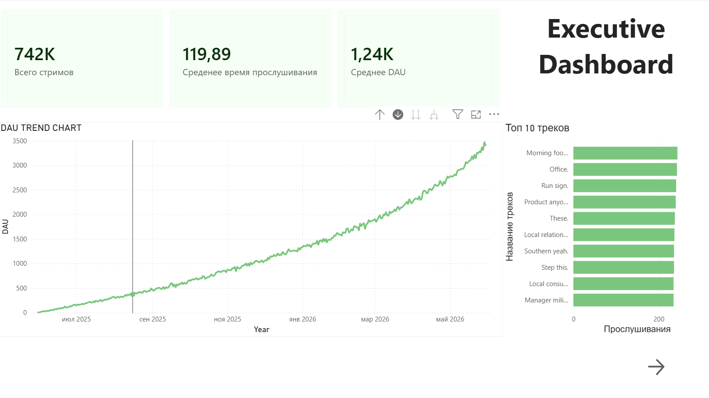
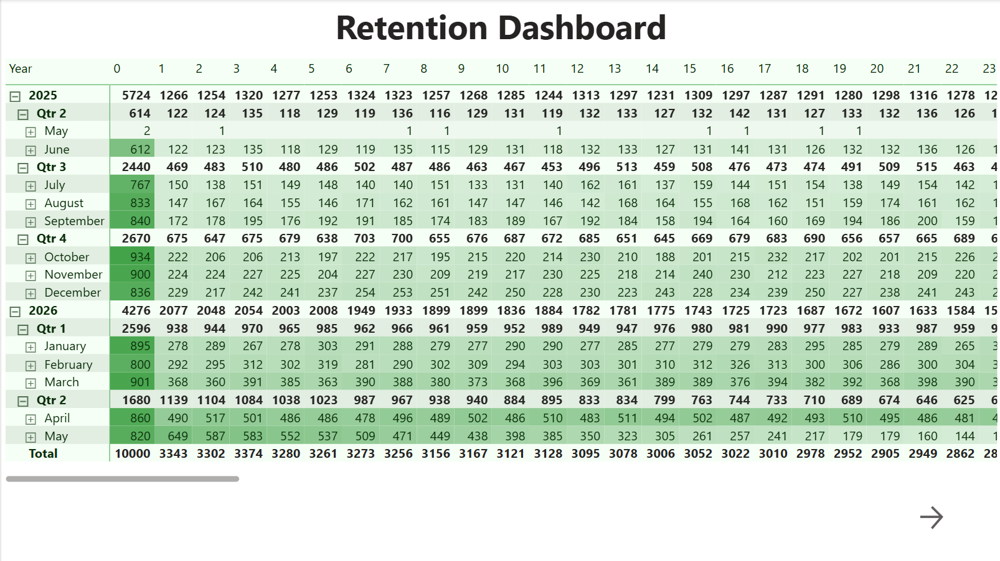
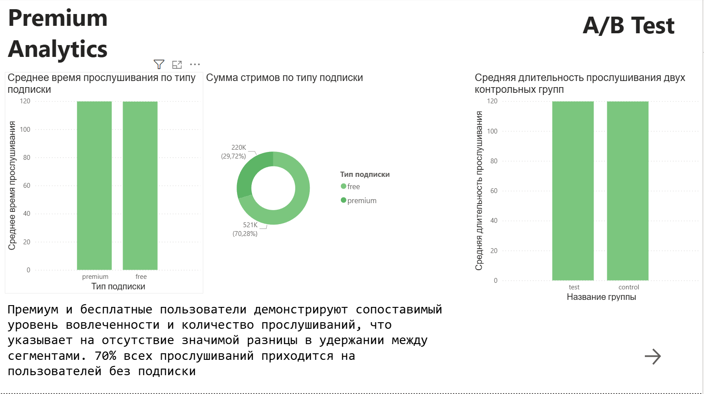

# Stream-analytics 
Аналитическая платформа для музыкального стримингового сервиса (Spotify-like) с использованием Python, PostgreSQL, SQL и Power BI. 

Проект моделирует полноценный workflow продуктовой аналитики: - генерация событий пользователей, 
- хранение данных, 
- SQL-аналитика, 
- retention/cohort analysis,
- A/B тестирование,
- BI-дашборды.

---

Проект создан как pet-project для практики:
- продуктовой аналитики,
- SQL,
- Python,
- визуализации данных,
- работы с event-based данными. 

---

# Используемый стек 

## Backend / Data 
- Python 
- PostgreSQL 
- SQLAlchemy 
- Pandas 
- NumPy 

## Аналитика 
- SQL 
- SciPy 
- Jupyter Notebook

## BI / Визуализация 
- Power BI 

## Infrastructure 
- Docker

---

# Возможности проекта

## Генерация данных

Смоделированы:

- пользователи,
- артисты,
- треки,
- прослушивания,
- подписки,
- A/B тесты.

Данные генерируются с реалистичным пользовательским поведением:

- различная активность пользователей,
- churn,
- premium/free сегменты,
- engagement patterns.

---

# Реализованные аналитические метрики
## Product Metrics
- DAU / MAU
- Retention
- Cohort Analysis
- Churn Rate
- Premium Conversion
- Average Listening Time
- Completion Rate
- Funnel Analysis

---

# SQL аналитика

В проекте реализованы:

- CTE
- Window Functions
- Materialized Views
- Cohort Queries
- Retention Analysis
- Product Funnels

---

# A/B тестирование

Реализован анализ эксперимента:

- control/test группы,
- сравнение engagement,
- t-test,
- statistical significance analysis.
 
---

# Power BI Dashboard

Созданы интерактивные дашборды:

- Executive Dashboard
- Retention Dashboard
- Premium Analytics и A/B Test Dashboard

---

# Структура проекта

stream-analytics/

dashboards/ 
data/ 
docs/ 
etl/ 
notebooks/ 
sql/
docker-compose.yml 
requirements.txt 
README.md

---

# Как запустить проект

1. Клонировать
git clone https://github.com/k0stt/stream-analytics.git
2. Запустить PostgreSQL
docker compose up -d
3. Создать virtual environment
python -m venv venv
4. Установить зависимости
pip install -r requirements.txt
5. Сгенерировать данные
python etl/generate_data.py

---

# Скриншоты

## Executive Dashboard

## Retention Dashboard

## A/B Test + Premium Dashboard

---

# Массальский Константин Андреевич

Pet-project для практики продуктовой аналитики и подготовки к стажировкам Data/Product Analyst.